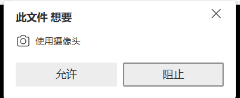
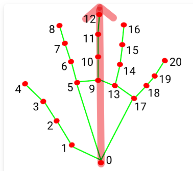
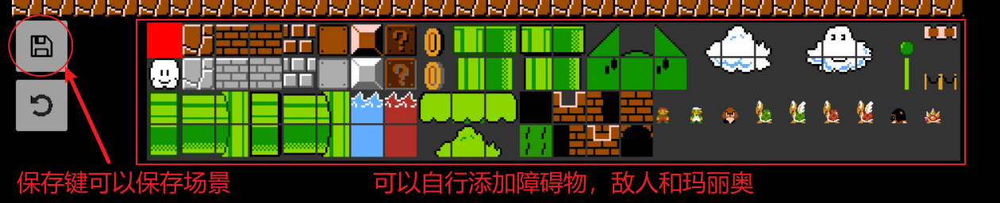

# mario-game-using-hand-detect
使用手势识别来玩超级玛丽奥

# 新手教程

1. 双击打开index.html
2. 浏览器弹窗，允许使用摄像头

3. 按钮控制玛丽奥运动

4. 通过手势识别控制玛丽奥运动

模型会检测手部关键点，上图中0到12形成一个向量，若向量指向左，即控制人物向左边运动，若向量指向右，即控制人物向右边运动，若向量指向上，即控制人物跳跃运动

5. 如何重新开始游戏

首先暂停游戏，可以按左上角的暂停，或者按下按钮“P”，然后游戏会进入暂停状态。左下角会出现一个Reload的按钮，点击即重新开始游戏。

# 高级玩法

首先暂停游戏，可以按左上角的暂停，或者按下按钮“P”，可以用游戏调试版编辑游戏场景。

